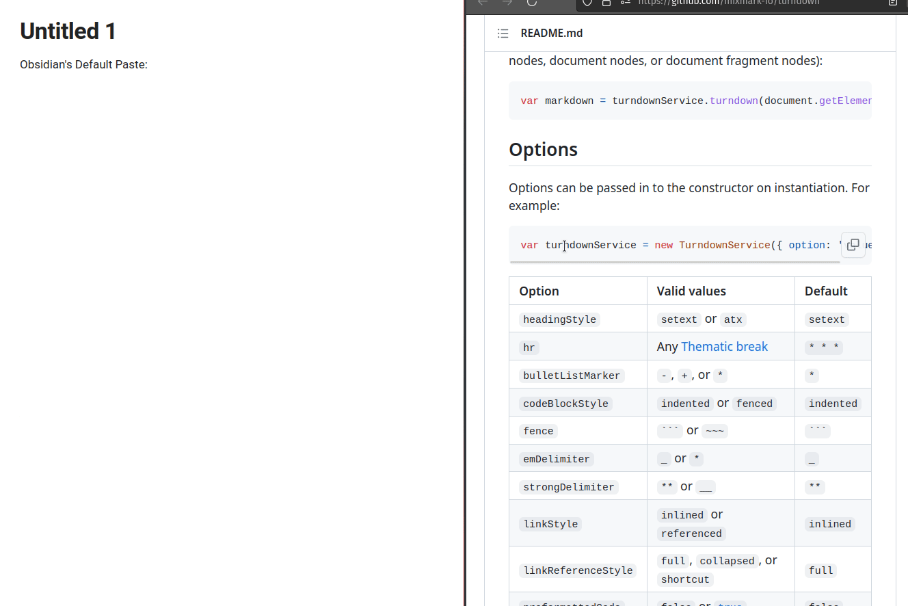

# Advanced Paste for Obsidian

[](https://www.paypal.com/paypalme/tokxxt)


This plugin provides advanced paste commands and enables you to create custom transforms for pasting.

Usage: Assign a hotkey to the command that you want to use and then press the hotkey to paste the content.

Personally, I prefer to assign <kbd>Ctrl</kbd>+<kbd>V</kbd> to [`Default`](#default), <kbd>Alt</kbd>+<kbd>V</kbd> to [`Smart Join`](#smart-join)
and <kbd>Alt</kbd>+<kbd>Shift</kbd>+<kbd>V</kbd> to [`Remove Blank Lines`](#remove-blank-lines).

> **Warning**
> Never add untrusted scripts to the script directory BECAUSE IT MIGHT DESTROY YOUR VAULT OR WORSE!

**You need to disable and re-enable this plugin in order to apply the changes to the script directory.**

# Features

## Default

This plugin provides a default transform that is better than Obsidian built-in. You can bind `Ctrl+V` to it to replace the Obsidian built-in paste function.

The default transform will convert html to markdown using [turndown](https://github.com/mixmark-io/turndown)
and [turndown-plugin-gfm](https://github.com/mixmark-io/turndown-plugin-gfm). Obsidian's built-in paste function also
uses turndown, but it doesn't use the [turndown-plugin-gfm](https://github.com/mixmark-io/turndown-plugin-gfm) plugin, which means that obsidian's built-in paste
doesn't support converting html tables to markdown tables, html task lists to markdown task lists, etc.



### TODO

-   [ ] try to eliminate the extra blank lines in the converted markdown.

## Smart Join

This command trims all the lines and join them by a space before pasting. It will automatically join the words that are broken by hyphens.

This command is especially useful when pasting from a PDF file.

## Join Lines

This command joins all the lines without trimming them before pasting.

## Remove Blank Lines

This command removes all the blank lines before pasting.

This command is useful when you copy something from a web page and you find that there are too many blank lines when directly pasting into obsidian.

## Raw HTML

This command pastes the raw HTML of the copied content.

## Custom Transforms

You can define your own custom transform by writing JavaScript.

1. Set your script directory in the settings of this plugin
   (Or stick to the default settings).
2. Create a JavaScript source file(`*.js` or `*.mjs`) in the script directory.
   (You can't do it in obsidian. You need an editor like VSCode)
3. Edit the JavaScript file to add your custom transform(s).
4. Disable this plugin and re-enable it to apply your changes.
5. Now you can find your custom transform in command platte and assign a hotkey to it.

# Creating Custom Transforms

The JavaScript source file will be imported as an ES Module.

To create a transform, you need to create an exported function:

```javascript
export function myTransform(input) {
    return input;
}
```

The function name (in start case) will become the name of your custom transform.

You can write multiple transforms in a single JavaScript source file.

By default, the input to your transform is the text in the clipboard.
To support other MIME types, you can set the `type` field of your transform to `"blob"`:

```javascript
export async function myBlobTransform(input) {
    if (!input.types.includes("text/html")) {
        return { kind: "err", value: "No html found in clipboard!" };
    }
    const html = await input.getType("text/html");
    return html.text();
}
myBlobTransform.type = "blob";
```

This way, the input to your transform is a
[`ClipboardItem`](https://developer.mozilla.org/en-US/docs/Web/API/ClipboardItem)
instead of a `string`.

Your transform function should return either a `string` or a `TransformResult`
(Of course, you can also return a `Promise` that resolves to one of them).

A `TransformResult` is a discriminated union. Its kind can only be `ok` or `err`.
When you return an `ok` variant from your transform function,
the `value` field should be the string of your final transformation result.
When you return an `err` variant, a notice, in which the `value` field will be displayed
as an error to the end user, will show up.

```javascript
{ kind: "ok", value: "string" }
{ kind: "err", value: "An error occurred!" }
```

## Advanced: Utilities

The transform function can take an optional second parameter `utils` which is an object containing some useful helpers.

Currently, the [turndown service](https://github.com/mixmark-io/turndown) is provided as a utility. You can call `turndown.turndown` to convert html to markdown.

You can call `saveAttachment` to save a blob to the vault. The function signature is:

```typescript
saveAttachment: (name: string, ext: string, data: ArrayBuffer) =>
    Promise<TFile>;
```

`lodash`, `moment.js` and `mine-types` are also provided as utilities. Check out the following example:

```javascript
export async function myTransform(
    input,
    { turndown, _, moment, mime, saveAttachment }
) {
    if (input.types.includes("text/html")) {
        const html = await input.getType("text/html");
        return turndown.turndown(await html.text());
    }
    const text = await input.getType("text/plain");
    return text.text();
}
myTransform.type = "blob";
```
